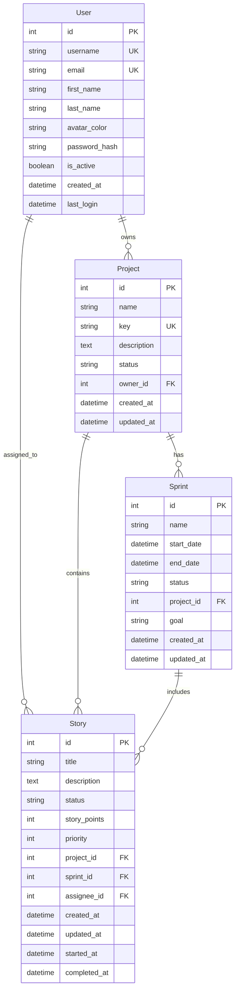

# データベース設計書

## 1. ER 図

## 2. テーブル定義

### 2.1 users（ユーザー）

| 物理名        | 論理名             | 型       | 長さ | NULL | キー | 初期値            | 説明                         |
| ------------- | ------------------ | -------- | ---- | ---- | ---- | ----------------- | ---------------------------- |
| id            | ID                 | INTEGER  | -    | NO   | PK   | -                 | ユーザー ID                  |
| username      | ユーザー名         | VARCHAR  | 64   | NO   | UK   | -                 | ログイン用のユーザー名       |
| email         | メールアドレス     | VARCHAR  | 120  | NO   | UK   | -                 | ログイン用のメールアドレス   |
| first_name    | 名                 | VARCHAR  | 64   | YES  | -    | -                 | ユーザーの名                 |
| last_name     | 姓                 | VARCHAR  | 64   | YES  | -    | -                 | ユーザーの姓                 |
| avatar_color  | アバター色         | VARCHAR  | 7    | YES  | -    | -                 | アバターの背景色（HEX 形式） |
| password_hash | パスワードハッシュ | VARCHAR  | 128  | YES  | -    | -                 | ハッシュ化されたパスワード   |
| is_active     | アクティブフラグ   | BOOLEAN  | -    | YES  | -    | TRUE              | アカウントの有効/無効状態    |
| created_at    | 作成日時           | DATETIME | -    | YES  | -    | CURRENT_TIMESTAMP | アカウント作成日時           |
| last_login    | 最終ログイン日時   | DATETIME | -    | YES  | -    | -                 | 最後にログインした日時       |

### 2.2 projects（プロジェクト）

| 物理名      | 論理名           | 型       | 長さ | NULL | キー | 初期値            | 説明                              |
| ----------- | ---------------- | -------- | ---- | ---- | ---- | ----------------- | --------------------------------- |
| id          | ID               | INTEGER  | -    | NO   | PK   | -                 | プロジェクト ID                   |
| name        | プロジェクト名   | VARCHAR  | 100  | NO   | -    | -                 | プロジェクトの表示名              |
| key         | プロジェクトキー | VARCHAR  | 10   | NO   | UK   | -                 | プロジェクトの一意の識別子        |
| description | 説明             | TEXT     | -    | YES  | -    | -                 | プロジェクトの詳細説明            |
| status      | ステータス       | VARCHAR  | 20   | YES  | -    | 'active'          | プロジェクトの状態                |
| owner_id    | オーナー ID      | INTEGER  | -    | NO   | FK   | -                 | プロジェクトオーナーのユーザー ID |
| created_at  | 作成日時         | DATETIME | -    | YES  | -    | CURRENT_TIMESTAMP | プロジェクト作成日時              |
| updated_at  | 更新日時         | DATETIME | -    | YES  | -    | CURRENT_TIMESTAMP | 最終更新日時                      |

### 2.3 sprints（スプリント）

| 物理名     | 論理名          | 型       | 長さ | NULL | キー | 初期値            | 説明                                          |
| ---------- | --------------- | -------- | ---- | ---- | ---- | ----------------- | --------------------------------------------- |
| id         | ID              | INTEGER  | -    | NO   | PK   | -                 | スプリント ID                                 |
| name       | スプリント名    | VARCHAR  | 100  | NO   | -    | -                 | スプリントの表示名                            |
| start_date | 開始日          | DATETIME | -    | YES  | -    | -                 | スプリント開始日                              |
| end_date   | 終了日          | DATETIME | -    | YES  | -    | -                 | スプリント終了日                              |
| status     | ステータス      | VARCHAR  | 20   | YES  | -    | 'planning'        | スプリントの状態（planning/active/completed） |
| project_id | プロジェクト ID | INTEGER  | -    | NO   | FK   | -                 | 所属プロジェクトの ID                         |
| goal       | ゴール          | VARCHAR  | 255  | YES  | -    | -                 | スプリントの目標                              |
| created_at | 作成日時        | DATETIME | -    | YES  | -    | CURRENT_TIMESTAMP | スプリント作成日時                            |
| updated_at | 更新日時        | DATETIME | -    | YES  | -    | CURRENT_TIMESTAMP | 最終更新日時                                  |

### 2.4 stories（ストーリー）

| 物理名       | 論理名             | 型       | 長さ | NULL | キー | 初期値            | 説明                                   |
| ------------ | ------------------ | -------- | ---- | ---- | ---- | ----------------- | -------------------------------------- |
| id           | ID                 | INTEGER  | -    | NO   | PK   | -                 | ストーリー ID                          |
| title        | タイトル           | VARCHAR  | 200  | NO   | -    | -                 | ストーリーのタイトル                   |
| description  | 説明               | TEXT     | -    | YES  | -    | -                 | ストーリーの詳細説明                   |
| status       | ステータス         | VARCHAR  | 20   | YES  | -    | 'todo'            | カンバンの状態（todo/doing/done）      |
| story_points | ストーリーポイント | INTEGER  | -    | YES  | -    | -                 | 見積もりポイント                       |
| priority     | 優先度             | INTEGER  | -    | YES  | -    | 0                 | 優先度（0:なし/1:低/2:中/3:高/4:最高） |
| project_id   | プロジェクト ID    | INTEGER  | -    | NO   | FK   | -                 | 所属プロジェクトの ID                  |
| sprint_id    | スプリント ID      | INTEGER  | -    | YES  | FK   | -                 | 所属スプリントの ID                    |
| assignee_id  | 担当者 ID          | INTEGER  | -    | YES  | FK   | -                 | 担当者のユーザー ID                    |
| created_at   | 作成日時           | DATETIME | -    | YES  | -    | CURRENT_TIMESTAMP | ストーリー作成日時                     |
| updated_at   | 更新日時           | DATETIME | -    | YES  | -    | CURRENT_TIMESTAMP | 最終更新日時                           |
| started_at   | 開始日時           | DATETIME | -    | YES  | -    | -                 | 作業開始日時                           |
| completed_at | 完了日時           | DATETIME | -    | YES  | -    | -                 | 作業完了日時                           |

## 3. インデックス

### 3.1 users

- PRIMARY KEY (id)
- UNIQUE KEY (username)
- UNIQUE KEY (email)

### 3.2 projects

- PRIMARY KEY (id)
- UNIQUE KEY (key)
- INDEX (owner_id)

### 3.3 sprints

- PRIMARY KEY (id)
- INDEX (project_id)
- INDEX (status)

### 3.4 stories

- PRIMARY KEY (id)
- INDEX (project_id)
- INDEX (sprint_id)
- INDEX (assignee_id)
- INDEX (status)
- INDEX (priority)

## 4. 外部キー制約

### 4.1 projects

- FOREIGN KEY (owner_id) REFERENCES users(id)

### 4.2 sprints

- FOREIGN KEY (project_id) REFERENCES projects(id)

### 4.3 stories

- FOREIGN KEY (project_id) REFERENCES projects(id)
- FOREIGN KEY (sprint_id) REFERENCES sprints(id)
- FOREIGN KEY (assignee_id) REFERENCES users(id)
