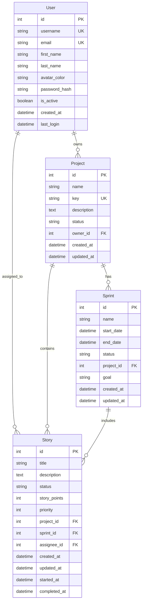

# Database Design Document

## 1. ER Diagram

## 2. Table Definitions

### 2.1 users

| Physical Name | Logical Name  | Type     | Length | NULL | Key | Default           | Description                          |
| ------------- | ------------- | -------- | ------ | ---- | --- | ----------------- | ------------------------------------ |
| id            | ID            | INTEGER  | -      | NO   | PK  | -                 | User identifier                      |
| username      | Username      | VARCHAR  | 64     | NO   | UK  | -                 | Login username                       |
| email         | Email         | VARCHAR  | 120    | NO   | UK  | -                 | Login email address                  |
| first_name    | First Name    | VARCHAR  | 64     | YES  | -   | -                 | User's first name                    |
| last_name     | Last Name     | VARCHAR  | 64     | YES  | -   | -                 | User's last name                     |
| avatar_color  | Avatar Color  | VARCHAR  | 7      | YES  | -   | -                 | Avatar background color (HEX format) |
| password_hash | Password Hash | VARCHAR  | 128    | YES  | -   | -                 | Hashed password                      |
| is_active     | Active Flag   | BOOLEAN  | -      | YES  | -   | TRUE              | Account status (active/inactive)     |
| created_at    | Created At    | DATETIME | -      | YES  | -   | CURRENT_TIMESTAMP | Account creation timestamp           |
| last_login    | Last Login    | DATETIME | -      | YES  | -   | -                 | Last login timestamp                 |

### 2.2 projects

| Physical Name | Logical Name | Type     | Length | NULL | Key | Default           | Description                  |
| ------------- | ------------ | -------- | ------ | ---- | --- | ----------------- | ---------------------------- |
| id            | ID           | INTEGER  | -      | NO   | PK  | -                 | Project identifier           |
| name          | Name         | VARCHAR  | 100    | NO   | -   | -                 | Project display name         |
| key           | Key          | VARCHAR  | 10     | NO   | UK  | -                 | Unique project identifier    |
| description   | Description  | TEXT     | -      | YES  | -   | -                 | Project detailed description |
| status        | Status       | VARCHAR  | 20     | YES  | -   | 'active'          | Project status               |
| owner_id      | Owner ID     | INTEGER  | -      | NO   | FK  | -                 | Project owner's user ID      |
| created_at    | Created At   | DATETIME | -      | YES  | -   | CURRENT_TIMESTAMP | Project creation timestamp   |
| updated_at    | Updated At   | DATETIME | -      | YES  | -   | CURRENT_TIMESTAMP | Last update timestamp        |

### 2.3 sprints

| Physical Name | Logical Name | Type     | Length | NULL | Key | Default           | Description                               |
| ------------- | ------------ | -------- | ------ | ---- | --- | ----------------- | ----------------------------------------- |
| id            | ID           | INTEGER  | -      | NO   | PK  | -                 | Sprint identifier                         |
| name          | Name         | VARCHAR  | 100    | NO   | -   | -                 | Sprint display name                       |
| start_date    | Start Date   | DATETIME | -      | YES  | -   | -                 | Sprint start date                         |
| end_date      | End Date     | DATETIME | -      | YES  | -   | -                 | Sprint end date                           |
| status        | Status       | VARCHAR  | 20     | YES  | -   | 'planning'        | Sprint status (planning/active/completed) |
| project_id    | Project ID   | INTEGER  | -      | NO   | FK  | -                 | Associated project ID                     |
| goal          | Goal         | VARCHAR  | 255    | YES  | -   | -                 | Sprint goal                               |
| created_at    | Created At   | DATETIME | -      | YES  | -   | CURRENT_TIMESTAMP | Sprint creation timestamp                 |
| updated_at    | Updated At   | DATETIME | -      | YES  | -   | CURRENT_TIMESTAMP | Last update timestamp                     |

### 2.4 stories

| Physical Name | Logical Name | Type     | Length | NULL | Key | Default           | Description                                    |
| ------------- | ------------ | -------- | ------ | ---- | --- | ----------------- | ---------------------------------------------- |
| id            | ID           | INTEGER  | -      | NO   | PK  | -                 | Story identifier                               |
| title         | Title        | VARCHAR  | 200    | NO   | -   | -                 | Story title                                    |
| description   | Description  | TEXT     | -      | YES  | -   | -                 | Story detailed description                     |
| status        | Status       | VARCHAR  | 20     | YES  | -   | 'todo'            | Kanban status (todo/doing/done)                |
| story_points  | Story Points | INTEGER  | -      | YES  | -   | -                 | Estimation points                              |
| priority      | Priority     | INTEGER  | -      | YES  | -   | 0                 | Priority (0:none/1:low/2:med/3:high/4:highest) |
| project_id    | Project ID   | INTEGER  | -      | NO   | FK  | -                 | Associated project ID                          |
| sprint_id     | Sprint ID    | INTEGER  | -      | YES  | FK  | -                 | Associated sprint ID                           |
| assignee_id   | Assignee ID  | INTEGER  | -      | YES  | FK  | -                 | Assigned user ID                               |
| created_at    | Created At   | DATETIME | -      | YES  | -   | CURRENT_TIMESTAMP | Story creation timestamp                       |
| updated_at    | Updated At   | DATETIME | -      | YES  | -   | CURRENT_TIMESTAMP | Last update timestamp                          |
| started_at    | Started At   | DATETIME | -      | YES  | -   | -                 | Work start timestamp                           |
| completed_at  | Completed At | DATETIME | -      | YES  | -   | -                 | Work completion timestamp                      |

## 3. Indexes

### 3.1 users

- PRIMARY KEY (id)
- UNIQUE KEY (username)
- UNIQUE KEY (email)

### 3.2 projects

- PRIMARY KEY (id)
- UNIQUE KEY (key)
- INDEX (owner_id)

### 3.3 sprints

- PRIMARY KEY (id)
- INDEX (project_id)
- INDEX (status)

### 3.4 stories

- PRIMARY KEY (id)
- INDEX (project_id)
- INDEX (sprint_id)
- INDEX (assignee_id)
- INDEX (status)
- INDEX (priority)

## 4. Foreign Key Constraints

### 4.1 projects

- FOREIGN KEY (owner_id) REFERENCES users(id)

### 4.2 sprints

- FOREIGN KEY (project_id) REFERENCES projects(id)

### 4.3 stories

- FOREIGN KEY (project_id) REFERENCES projects(id)
- FOREIGN KEY (sprint_id) REFERENCES sprints(id)
- FOREIGN KEY (assignee_id) REFERENCES users(id)
