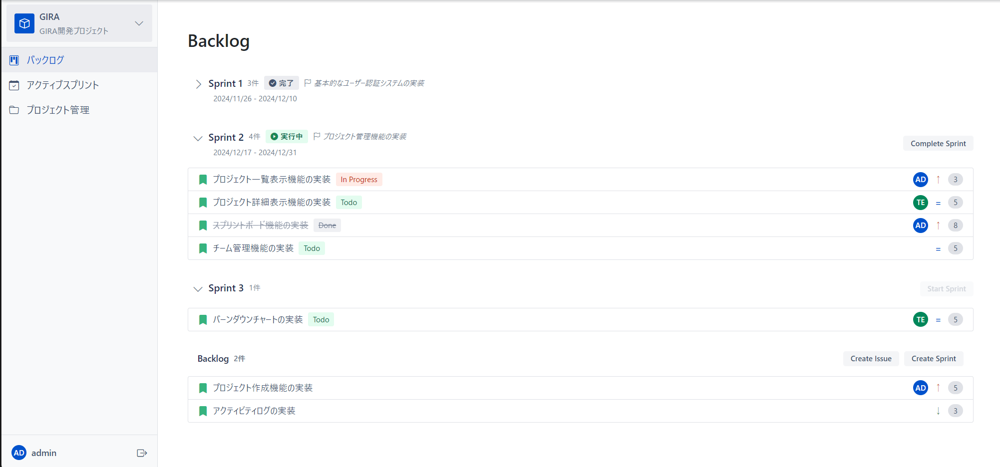

# バックログ画面詳細設計書

## 1. 基本情報

### 1.1 画面情報

| 項目         | 内容                                   |
| ------------ | -------------------------------------- |
| 画面 ID      | SCR003                                 |
| 画面名       | バックログ                             |
| 機能概要     | プロダクトバックログとスプリントの管理 |
| アクセス権限 | 一般ユーザー以上                       |

### 1.2 画面遷移

```mermaid
graph LR
    A[プロジェクト一覧] --> B[バックログ]
    B --> C[かんばんボード]

    style A fill:#f9f,stroke:#333,stroke-width:2px
    style B fill:#bbf,stroke:#333,stroke-width:2px
    style C fill:#bfb,stroke:#333,stroke-width:2px
```

### 1.3 データ I/F

#### 1.3.1 使用テーブル

| テーブル名 | 用途             | 主な用途                           |
| ---------- | ---------------- | ---------------------------------- |
| Sprint     | スプリント情報   | スプリントの表示、作成、状態管理   |
| Story      | ストーリー情報   | ストーリーの表示、作成、編集、移動 |
| User       | ユーザー情報     | 担当者の表示、選択                 |
| Project    | プロジェクト情報 | 現在のプロジェクト情報の表示       |

## 2. 画面構成

### 2.1 メイン画面レイアウト



### 2.2 コンテンツ詳細

#### 2.2.1 スプリントセクション

##### 入力項目

| 項目         | 種類     | 初期値   | 入力チェック       | 備考                |
| ------------ | -------- | -------- | ------------------ | ------------------- |
| スプリント名 | テキスト | Sprint N | 必須、最大 50 文字 | 自動採番（N：連番） |
| 開始日       | 日付     | -        | 未来日付           | カレンダーから選択  |
| 終了日       | 日付     | -        | 開始日より後の日付 | カレンダーから選択  |
| 目標         | テキスト | -        | 最大 1000 文字     | マークダウン対応    |

##### 表示項目

| 項目         | データ型 | DB 項目                              | 表示形式                |
| ------------ | -------- | ------------------------------------ | ----------------------- |
| スプリント名 | 文字列   | Sprint.name                          | テキスト                |
| 状態         | 文字列   | Sprint.status                        | アイコン＋テキスト      |
| 期間         | 日付     | Sprint.start_date<br>Sprint.end_date | YYYY/MM/DD - YYYY/MM/DD |
| ストーリー数 | 数値     | -                                    | n 件（集計値）          |
| 実行状況     | 文字列   | Sprint.status                        | アイコン＋実行中/完了   |

#### 2.2.2 ストーリー作成/編集モーダル

##### 入力項目

| 項目     | 種類           | 初期値 | 入力チェック        | 備考                       |
| -------- | -------------- | ------ | ------------------- | -------------------------- |
| タイトル | テキスト       | -      | 必須、最大 200 文字 | -                          |
| 説明     | テキストエリア | -      | 最大 1000 文字      | マークダウン対応           |
| 担当者   | セレクト       | -      | -                   | アクティブユーザーから選択 |
| 優先度   | セレクト       | None   | -                   | 5 段階から選択             |
| ポイント | 数値           | 0      | 0-100 の整数        | -                          |
| 状態     | セレクト       | todo   | -                   | todo/doing/done から選択   |

##### 表示項目

| 項目     | データ型 | DB 項目           | 表示形式               |
| -------- | -------- | ----------------- | ---------------------- |
| タイトル | 文字列   | Story.title       | テキスト               |
| 説明     | 文字列   | Story.description | マークダウン HTML      |
| 担当者   | 整数     | Story.assignee_id | ユーザーアイコン＋名前 |
| 優先度   | 整数     | Story.priority    | アイコン（色分け）     |
| ポイント | 整数     | Story.points      | 数値                   |
| 状態     | 文字列   | Story.status      | 色付きラベル           |

#### ストーリー状態表示

| 状態  | 背景色  | 文字色  | その他               |
| ----- | ------- | ------- | -------------------- |
| Todo  | #E3FCEF | #006644 | -                    |
| Doing | #FFEBE6 | #BF2600 | -                    |
| Done  | #EBECF0 | #42526E | タイトルに取り消し線 |

## 3. イベント

### 3.1 スプリント管理

#### 3.1.1 スプリント作成

1. イベント名：スプリント作成ボタン押下
2. 処理フロー

   1. スプリント作成モーダルを表示
   2. 入力値のバリデーション
   3. スプリントレコードの作成
   4. 画面の再表示

3. データ検索ロジック

```sql
-- スプリント番号の採番
SELECT COALESCE(MAX(CAST(SUBSTRING(name FROM 7) AS INTEGER)), 0) + 1
FROM sprints
WHERE project_id = :project_id;
```

4. 結果表現

- 成功時：スプリントセクションに新規スプリントを表示
- 失敗時：エラーメッセージをモーダル内に表示

#### 3.1.2 スプリント開 ��

1. イベント名：Start Sprint ボタン押下
2. 処理フロー

   1. アクティブスプリントの存在チェック
   2. 前のスプリントの状態チェック
   3. スプリントのステータス更新
   4. 画面の再表示

3. データ検索ロジック

```sql
-- アクティブスプリントのチェック
SELECT COUNT(*)
FROM sprints
WHERE project_id = :project_id
  AND status = 'active';

-- 前のスプリントのチェック
SELECT COUNT(*)
FROM sprints
WHERE project_id = :project_id
  AND status = 'planning'
  AND name < :current_sprint_name;
```

4. 結果表現

- 成功時：スプリントの状態とボタンを更新
- 失敗時：エラーメッセージをポップアップ表示

#### 3.1.3 スプリント完了

1. イベント名：Complete Sprint ボタン押下
2. 処理フロー

   1. 未完了ストーリーの確認
   2. スプリントのステータス更新
   3. 画面の再表示

3. データ検索ロジック

```sql
-- 未完了ストーリーの確認
SELECT COUNT(*)
FROM stories
WHERE sprint_id = :sprint_id
  AND status != 'done';
```

4. 結果表現

- 成功時：スプリントを完了状態に更新
- 失敗時：警告メッセージを表示

### 3.2 ストーリー管理

#### 3.2.1 ストーリー作成

1. イベント名：Create Issue ボタン押下
2. 処理フロー

   1. ストーリー作成モーダルを表示
   2. 入力値のバリデーション
   3. ストーリーレコードの作成
   4. バックログの再表示

3. データ検索ロジック

```sql
-- アクティブユーザーの取得
SELECT id, first_name, last_name
FROM users
WHERE is_active = true
ORDER BY first_name, last_name;
```

4. 結果表現

- 成功時：バックログに新規ストーリーを表示
- 失敗時：エラーメッセージをモーダル内に表示

#### 3.2.2 ドラッグ&ドロップ

1. イベント名：ストーリーカードのドラッグ&ドロップ
2. 処理フロー

   1. ドロップ位置の判定
   2. ストーリーの所属更新
   3. 件数の更新
   4. 表示の更新

3. データ検索ロジック

```sql
-- ストーリーの移動
UPDATE stories
SET sprint_id = :sprint_id,
    status = CASE WHEN :sprint_id IS NULL THEN 'backlog' ELSE 'sprint' END
WHERE id = :story_id;
```

4. 結果表現

- 成功時：ストーリーの位置と件数を更新
- 失敗時：元の位置に戻す

## 4. エラー処理

### 4.1 入力チェック

| 項目               | チェック内容 | エラーメッセージ                       |
| ------------------ | ------------ | -------------------------------------- |
| スプリント開始日   | 未来日付     | 開始日は今日以降で指定してください     |
| スプリント終了日   | 開始日より後 | 終了日は開始日より後で指定してください |
| ストーリータイトル | 必須、最大長 | タイトルは必須です                     |
| ストーリーポイント | 数値範囲     | 0-100 の整数で指定してください         |

### 4.2 業務チェック

| チェック内容               | エラーメッセージ                     |
| -------------------------- | ------------------------------------ |
| アクティブスプリントの重複 | 他のスプリントが進行中です           |
| スプリント開始順序         | 前のスプリントを先に開始してください |

## 5. 非同期処理

### 5.1 API 一覧

| API 名               | メソッド | 用途           |
| -------------------- | -------- | -------------- |
| /api/story/create    | POST     | ストーリー作成 |
| /api/story/update    | POST     | ストーリー更新 |
| /api/story/move      | POST     | ストーリー移動 |
| /api/sprint/start    | POST     | スプリント開始 |
| /api/sprint/complete | POST     | スプリント完了 |

### 5.2 エラーハンドリング

1. 通信エラー時

   - エラーメッセージの表示
   - 自動リトライ（最大 3 回）
   - 失敗時のロールバック

2. バリデーションエラー時
   - エラーメッセージの表示
   - 入力項目のハイライト
   - 保存ボタンの無効化
