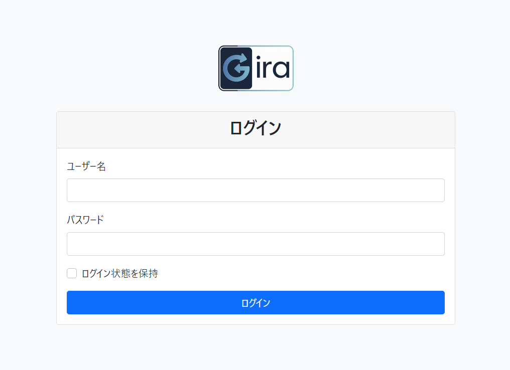

# ログイン画面詳細設計書

## 1. 基本情報

### 1.1 画面情報

| 項目         | 内容                           |
| ------------ | ------------------------------ |
| 画面 ID      | SCR000                         |
| 画面名       | ログイン                       |
| 機能概要     | ユーザー認証とシステムへの入口 |
| アクセス権限 | 未認証ユーザー                 |

### 1.2 画面遷移

| 遷移元   | 遷移先             | 遷移条件         |
| -------- | ------------------ | ---------------- |
| -        | ログイン           | 直接アクセス     |
| ログイン | プロジェクト一覧   | ログイン成功時   |
| ログイン | パスワードリセット | リンククリック時 |

### 1.3 データ I/F

#### 1.3.1 使用テーブル

| テーブル名 | 用途         | 主な用途                   |
| ---------- | ------------ | -------------------------- |
| User       | ユーザー情報 | ログイン認証、ユーザー情報 |
| Session    | セッション   | ログインセッション管理     |

## 2. 画面構成

### 2.1 メイン画面レイアウト



### 2.2 コンテンツ詳細

#### 2.2.1 ログインフォーム

##### 入力項目

| 項目           | 種類       | 初期値 | 入力チェック     | 備考                     |
| -------------- | ---------- | ------ | ---------------- | ------------------------ |
| メールアドレス | メール     | -      | 必須、メール形式 | -                        |
| パスワード     | パスワード | -      | 必須、8 文字以上 | 英数字記号混在必須       |
| ログイン保持   | チェック   | false  | -                | セッション保持期間の延長 |

##### 表示項目

| 項目             | データ型 | DB 項目 | 表示形式         |
| ---------------- | -------- | ------- | ---------------- |
| エラーメッセージ | 文字列   | -       | テキスト（赤字） |
| ログインボタン   | ボタン   | -       | 通常/無効        |

## 3. イベント

### 3.1 認証処理

#### 3.1.1 ログイン

1. イベント名：ログインボタン押下
2. 処理フロー

   1. 入力値のバリデーション
   2. ユーザー認証
   3. セッション作成
   4. プロジェクト一覧画面への遷移

3. データ検索ロジック

```sql
-- ユーザー認証
SELECT id, email, password_hash, status
FROM users
WHERE email = :email
  AND status = 'active';

-- セッション作成
INSERT INTO sessions (user_id, token, expires_at)
VALUES (:user_id, :token, :expires_at);
```

4. 結果表現

- 成功時：プロジェクト一覧画面に遷移
- 失敗時：エラーメッセージを表示

#### 3.1.2 自動ログイン

1. イベント名：ページロード時
2. 処理フロー

   1. セッショントークンの確認
   2. セッションの有効性確認
   3. 自動ログイン処理

3. データ検索ロジック

```sql
-- セッション確認
SELECT s.*, u.status
FROM sessions s
JOIN users u ON s.user_id = u.id
WHERE s.token = :token
  AND s.expires_at > CURRENT_TIMESTAMP
  AND u.status = 'active';
```

4. 結果表現

- 成功時：プロジェクト一覧画面に遷移
- 失敗時：ログインフォームを表示

## 4. エラー処理

### 4.1 入力チェック

| 項目           | チェック内容     | エラーメッセージ                          |
| -------------- | ---------------- | ----------------------------------------- |
| メールアドレス | 必須、メール形式 | 有効なメールアドレスを入力してください    |
| パスワード     | 必須、文字数     | パスワードは 8 文字以上で入力してください |

### 4.2 業務チェック

| チェック内容     | エラーメッセージ                                             |
| ---------------- | ------------------------------------------------------------ |
| アカウントの存在 | メールアドレスまたはパスワードが違います                     |
| アカウントの状態 | このアカウントは現在使用できません                           |
| ログイン試行回数 | ログインに失敗しました。しばらく待ってから再度お試しください |

## 5. 非同期処理

### 5.1 API 一覧

| API 名            | メソッド | 用途           |
| ----------------- | -------- | -------------- |
| /api/auth/login   | POST     | ログイン処理   |
| /api/auth/logout  | POST     | ログアウト処理 |
| /api/auth/session | GET      | セッション確認 |

### 5.2 エラーハンドリング

1. 通信エラー時

   - エラーメッセージの表示
   - 自動リトライ（最大 3 回）
   - 失敗時のエラー表示

2. バリデーションエラー時
   - エラーメッセージの表示
   - 入力項目のハイライト
   - ログインボタンの無効化

## 6. セキュリティ対策

### 6.1 入力値の検証

- XSS 対策：入力値のエスケープ処理
- SQL インジェクション対策：プリペアドステートメントの使用
- CSRF 対策：トークンの発行と検証

### 6.2 認証・認可

- パスワードのハッシュ化（bcrypt）
- セッショントークンの暗号化
- ブルートフォース攻撃対策（レートリミット）
- セッションハイジャック対策（セキュアクッキー）
