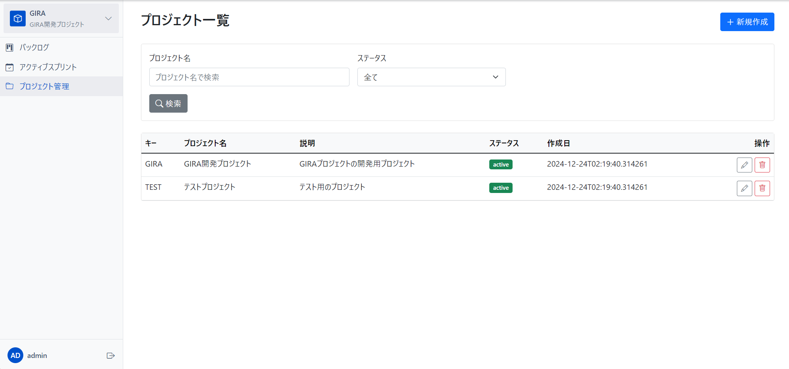
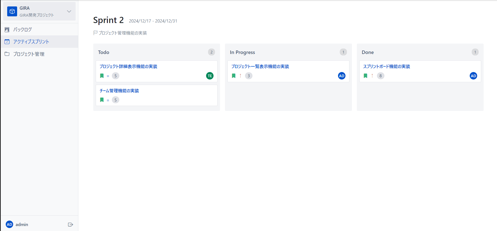
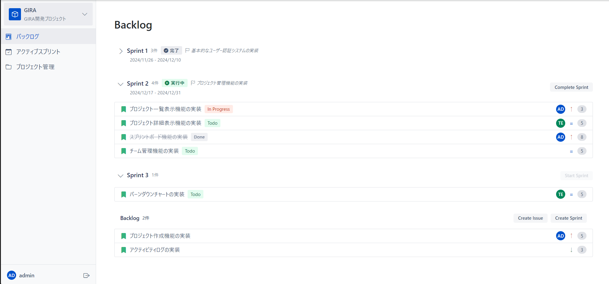

<!-- _class: lead
_color: white
-->

# GIRA <br> 開発ガイド

2025 年 1 月

---

## 目次

1. システム概要
2. 開発環境のセットアップ
3. 機能開発の流れ
4. コーディング規約
5. テスト方針
6. デプロイメント

---

## 1. システム概要

### プロジェクト管理



- プロジェクトの作成・編集
- メンバー管理
- 進捗の可視化
- ダッシュボード

---

### カンバンボード



- ドラッグ＆ドロップ
- ステータス管理
- タスクの詳細表示
- フィルタリング

---

### バックログ管理



- ストーリー作成
- スプリント管理
- 優先順位設定
- ポイント見積もり

---

## 2. 開発環境のセットアップ

### 必要なツール

- Python 3.8+
- Git
- VSCode (推奨)
- SQLite

### 初期セットアップ

```bash
git clone https://github.com/yourusername/gira.git
python -m venv venv
source venv/bin/activate
pip install -r requirements.txt
```

---

## 3. 機能開発の流れ

### プロジェクト構造

```
gira/
  ├── app/
  │   ├── models/     # データモデル
  │   ├── views/      # ビューロジック
  │   ├── forms/      # フォーム定義
  │   └── templates/  # HTMLテンプレート
  ├── tests/          # テストコード
  └── doc/            # ドキュメント
```

---

### 開発ステップ

1. 要件定義

   - 基本設計書の確認
   - 機能範囲の明確化
   - UI 設計の確認

2. 実装

   - モデル作成
   - ビュー実装
   - テンプレート作成

3. テスト
   - ユニットテスト
   - 結合テスト

---

## 4. コーディング規約

### Python コード

- PEP 8 準拠
- 関数名：snake_case
- クラス名：PascalCase
- 定数：UPPER_CASE

### コメント

- 日本語で記述
- docstring 必須
- ロジック説明

---

## 5. テスト方針

### テスト実行

```bash
# 全テスト実行
pytest

# 特定機能のテスト
pytest tests/test_project.py
```

### カバレッジ確認

```bash
pytest --cov=app tests/
```

---

## 6. デプロイメント

### 開発環境

```bash
flask run
```

### 本番環境

- gunicorn 使用
- nginx リバースプロキシ
- 環境変数設定

---

## よくある問題と解決方法

### データベース関連

- マイグレーション：`flask db upgrade`
- テストデータ：`flask init-db --with-testdata`

### 開発環境

- 依存関係：`pip install -r requirements.txt`
- デバッグ：`export FLASK_DEBUG=1`

---

## 参考リンク

- [データベース設計書](../basic-design/database.md)
- [API 仕様書](../basic-design/api-spec.md)
- [テストケース一覧](../test-case/unit.md)
- [インフラ構成図](../basic-design/infrastructure.md)
