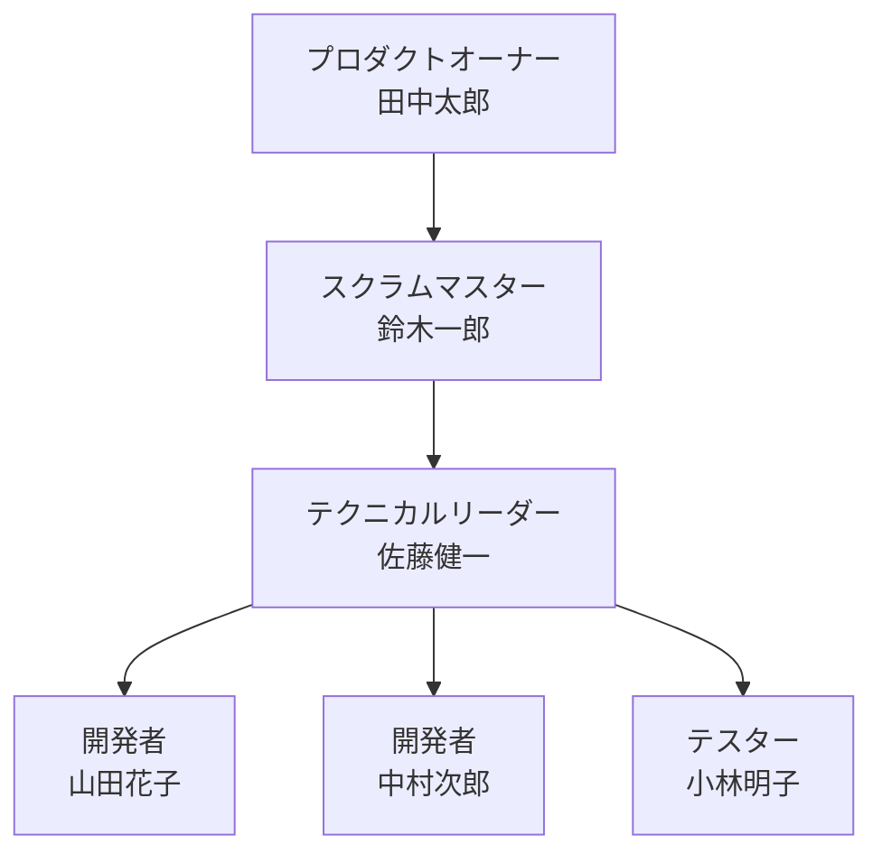
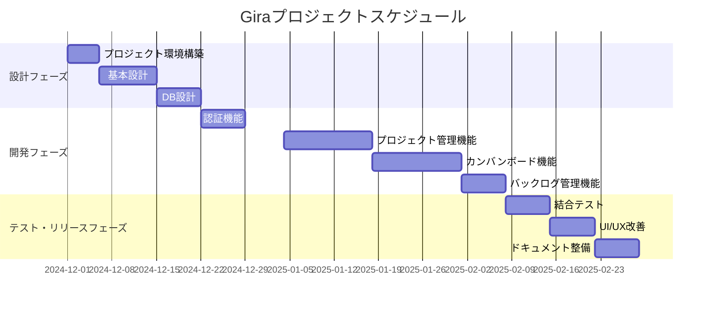

# Gira プロジェクト計画書

## 1. プロジェクト基本背景

本プロジェクトは、チームの効率的なタスク管理とプロジェクト進行を支援するための Gira システムの開発を目的としています。
Gira は、カンバンボード機能とバックログ管理機能を備えた、使いやすく直感的なプロジェクト管理ツールです。

## 2. プロジェクト体制

### 2.1 組織体制図

### 2.2 役割と責任

| 役割               | 担当者               | 主な責任                                                                         |
| ------------------ | -------------------- | -------------------------------------------------------------------------------- |
| プロダクトオーナー | 田中太郎             | ・プロダクトバックログの管理 ・優先順位の決定 ・ステークホルダーとの調整   |
| スクラムマスター   | 鈴木一郎             | ・スクラムプロセスの推進 ・チーム内の障害除去 ・チームのファシリテーション |
| テクニカルリーダー | 佐藤健一             | ・技術的な意思決定 ・アーキテクチャ設計 ・コードレビュー                   |
| 開発者             | 山田花子 中村次郎 | ・機能の実装 ・単体テスト作成 ・コードレビュー                             |
| テスター           | 小林明子             | ・テスト計画策定 ・テスト実施 ・品質保証                                   |

## 3. 開発プロセス

### 3.1 Scrum ミーティングスケジュール

| ミーティング       | 頻度           | 時間        | 目的                   |
| ------------------ | -------------- | ----------- | ---------------------- |
| デイリースクラム   | 毎日           | 9:00-9:15   | 進捗確認、障害共有     |
| スプリントレビュー | 2 週間毎（火） | 13:00-14:00 | 成果物のデモと評価     |
| スプリント計画     | 2 週間毎（水） | 10:00-12:00 | 次スプリントの計画立案 |
| レトロスペクティブ | 2 週間毎（水） | 14:00-15:00 | プロセス改善の検討     |

### 3.2 スプリント計画

| スプリント | 期間            | 主な目標                                               |
| ---------- | --------------- | ------------------------------------------------------ |
| Sprint 1   | 2024/12/1-12/14 | ・プロジェクト環境構築 ・基本設計完了               |
| Sprint 2   | 12/15-12/28     | ・DB 設計完了 ・認証機能実装                        |
| Sprint 3   | 2025/1/4-1/17   | ・プロジェクト管理機能実装 ・カンバンボード基本機能 |
| Sprint 4   | 1/18-1/31       | ・バックログ管理機能 ・UI/UX 改善                   |
| Sprint 5   | 2/1-2/14        | ・テスト実施 ・バグ修正                             |
| Sprint 6   | 2/15-2/28       | ・ドキュメント整備 ・最終調整                       |

### 3.3 ガントチャート

## 4. 成果物一覧

### 4.1 ドキュメント

- [ ] 基本設計書
- [ ] 詳細設計書
- [ ] データベース設計書
- [ ] API ドキュメント
- [ ] テスト計画書
- [ ] テスト結果報告書
- [ ] ユーザーマニュアル
- [ ] 運用保守マニュアル

### 4.2 ソフトウェア成果物

- [ ] ソースコード
- [ ] 単体テストコード
- [ ] 結合テストコード
- [ ] ビルドスクリプト
- [ ] デプロイメントスクリプト
- [ ] データベーススクリプト

## 5. リスク管理

| リスク               | 影響度 | 対策                                                 |
| -------------------- | ------ | ---------------------------------------------------- |
| チームメンバーの病欠 | 中     | ・クロストレーニングの実施 ・ドキュメント整備     |
| 技術的な課題の発生   | 高     | ・早期の PoC 実施 ・外部専門家への相談            |
| 要件の変更           | 中     | ・変更管理プロセスの確立 ・バッファの確保         |
| 環境構築の遅延       | 低     | ・事前の環境要件の明確化 ・自動化スクリプトの準備 |

## 6. コミュニケーション計画

### 6.1 情報共有ツール

- プロジェクト管理：Gira
- コミュニケーション：Slack
- ドキュメント管理：Confluence
- ソース管理：GitHub

### 6.2 レポーティング

| レポート種類 | 頻度         | 対象者         |
| ------------ | ------------ | -------------- |
| 進捗報告     | 週次         | 全 stakeholder |
| 品質レポート | スプリント毎 | PO, SM, TL     |
| リスク報告   | 随時         | 全メンバー     |
